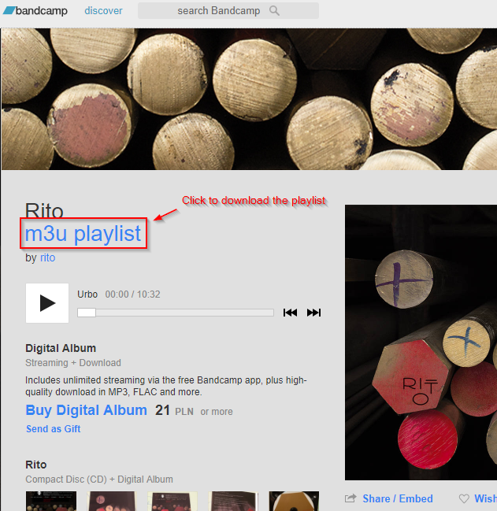

# Bandcamp M3U

Userscript which allows to generate and download M3U playlist from
any Bandcamp album.

Instead of listening in a clumsy web page player, download the playlist and
stream the music in your favourite music software (assuming it supports
m3u playlists and http streaming).



Tested on Chrome with
[Tampermonkey](https://chrome.google.com/webstore/detail/tampermonkey/dhdgffkkebhmkfjojejmpbldmpobfkfo)
extension)

## Installation

Make sure you have [Tampermonkey](https://chrome.google.com/webstore/detail/tampermonkey/dhdgffkkebhmkfjojejmpbldmpobfkfo)
or compatible extension for your browser. Follow instructions for your extensions
on how to import script (for Tampermonkey it will be as easy as opening the control
panel, adding new script and pasting contents of `bandcamp-m3u.js` inside).

## License

This code is licensed under the [WTFPL](http://www.wtfpl.net/) license:

```text
        DO WHAT THE FUCK YOU WANT TO PUBLIC LICENSE
                    Version 2, December 2004

 Copyright (C) 2004 Sam Hocevar <sam@hocevar.net>

 Everyone is permitted to copy and distribute verbatim or modified
 copies of this license document, and changing it is allowed as long
 as the name is changed.

            DO WHAT THE FUCK YOU WANT TO PUBLIC LICENSE
   TERMS AND CONDITIONS FOR COPYING, DISTRIBUTION AND MODIFICATION

  0. You just DO WHAT THE FUCK YOU WANT TO.
```
